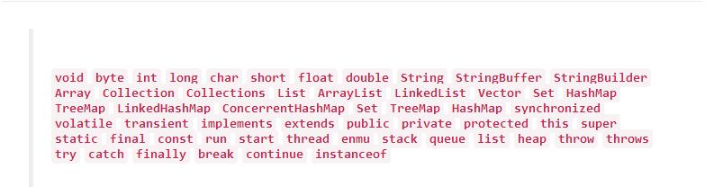

# 2018年Java程序员最新BAT面试题
原文：[2018年Java程序员最新BAT面试题][1] 

最近，各大公司开始了春招，很多人已经开始在准备面试了，特地来总结下初中级程序员应该掌握的面试题目。这篇面试指南，只适用于初中级程序员，其中不涉及分布式等问题。关于中高级的程序员问题，我后面可能再出一篇文章。

对于一个初中级程序员来说，面试问题不仅仅涉及到Java语言，还会包括很多其他知识，比如计算机基础知识（数据结构、计算机网络、操作系统等）、C语言基础、Java底层知识以及一些框架相关知识等。本文几乎覆盖到了所有领域。

1. 计算机基础知识
2. C语言基础
3. Java基础
4. Java高级
5. Java Web
6. 设计模式
7. 知识的综合能力
8. 工具使用
9. 项目相关
10. 技术热情
11. 表达能力
12. 思考方式
13. 其他

还有，我知道很多人会问关于这些题目的答案问题。答案我都有，由于篇幅有限没办法直接贴上来。这些题目的答案我会在我的下篇文章分享出来，感谢关注。

必会关键字 
  
# 计算机基础知识
## 数据结构

1. 什么是队列、栈、链表
2. 什么是树（平衡树,排序树,B树,B+树,R树,红黑树）、堆（大根堆、小根堆）、图（有向图、无向图、拓扑）
3. 栈和队列的相同和不同之处
4. 栈通常采用的两种存储结构
5. 两个栈实现队列，和两个队列实现栈

## 算法
1、排序都有哪几种方法？

2、会写常用的排序算法，如快排，归并等。

3、各种排序算法的时间复杂度和稳定性，重点快排。

4、单链表的遍历和逆序

5、深度优先搜索和广度优先搜索

6、最小生成树

7、常见Hash算法，哈希的原理和代价

8、全排列、贪心算法、KMP算法、hash算法

9、一致性Hash算法

## 操作系统
1、虚拟内存管理

2、换页算法

3、进程间通信

4、进程同步：生产者消费者问题、哲学家就餐问题、读者写者问题

5、死锁的四个必要条件，避免方法

6、Linux的一些基本命令，如ls、tail、chmod等
## 计算机网络
1、tcp,udp区别

2、HTTP请求和响应的全过程

3、HTTP常见响应码：200、301、302、404、500

4、get和post的区别

5、forward和redirect的区别

6、osi七层模型

7、tcp/ip四层模型及原理

8、TCP和UDP区别

9、TCP的三次握手，四次关闭

10、丢包,粘包，

11、容量控制，拥塞控制

12、子网划分

13、IPV4和IPV6

14、HTTPS和HTTP/2
## 数据库：
1、范式

2、数据库事务和隔离级别

3、为什么需要锁，锁定分类，锁粒度

4、乐观锁，悲观锁的概念及实现方式

5、分页如何实现（Oracle，MySql）

6、Mysql引擎

7、MYSQL语句优化

8、从一张大表读取数据，如何解决性能问题

9、内连接，左连接，右连接作用及区别

10、Statement和PreparedStatement之间的区别

11、索引以及索引的实现(B+树介绍、和B树、R树区别

12、什么是数据库连接池
## 海量数据处理
1、海量日志数据，如何提取出某日访问淘宝次数最多的IP

2、上亿数据，统计其中出现次数最多的前N个数据

3、5亿个int，找出他们的中位数

4、两个文件，各存放50亿条URL，每个URL占64字节。内存限制是4G，找出两个文件中相同的URL

5、有40亿个不重复的unsigned int的整数，没排过序，现在给一个数，如何快速判断这个数是否在这40亿个数当中。

6、提示：分治、Hash映射、堆排序、双层桶划分、Bloom filter、bitmap、数据库索引、mapreduce
# C语言基础
## 构造函数、析构函数
1、构造函数和析构函数

2、为什么不要在构造器中调用虚函数

3、为什么不要在析构函数中抛出异常
## c++相关
1、面向对象的三大基本特征，五大基本原则

2、C++继承的内存布局

3、C++多态的实现机制

4、new/deletr和malloc/free的区别
## 其他
1、为什么使用补码

2、C语言中的内存泄漏

3、进制转换

4、自己编写strlen/strcpy/strcmp

5、C、C++以及Java之间的区别和各自优缺点
# Java基础
## 封装、继承、多态
1、Java中实现多态的机制是什么，动态多态和静态多态的区别

2、接口和抽象类的区别，如何选择

3、Java能不能多继承，可不可以多实现

4、Static Nested Class 和 Inner Class的不同

5、重载和重写的区别。

6、是否可以继承String类

7、构造器是否可被override?

8、public,protected,private的区别?
## 集合相关
1、列举几个Java中Collection类库中的常用类

2、List、Set、Map是否都继承自Collection接口？存储特点分别是什么？

3、ArrayList、LinkedList和Vector之间的区别与联系

4、HashMap和Hashtable、TreeMap以及ConcurrentHashMap的区别

5、Collection 和 Collections的区别

6、其他的集合类：treeset,linkedhashmap等。
## 异常相关
1、Error和Exception的区别

2、异常的类型，什么是运行时异常

3、final、finally和finalize的区别

4、try-catch-finally中，如果在catch中return了，finally中的代码还会执行么，原理是什么？

5、列举3个以上的RuntimeException

6、Java中的异常处理机制的简单原理和应用

## 其它
1、String和StringBuffer、StringBuilder的区别

2、==和equals的区别

3、hashCode的作用，和equals方法的关系

4、Input/OutputStream和Reader/Writer有什么区别

5、如何在字符流和字节流之间转换？

6、switch可以使用那些数据类型

7、Java的四种引用

8、序列化与反序列化

9、正则表达式

10、int和Integer的区别，什么是自动装箱和自动拆箱
# Java高级
## 多线程
1、进程和线程的区别

2、并行和并发的区别和联系

3、同步与异步

4、多线程的实现方式，有什么区别

5、什么叫守护线程

6、如何停止一个线程？

7、什么是线程安全？

8、synchronized 和 lock的区别

9、当一个线程进入一个对象的一个synchronized方法后，其它线程是否可进入此对象的其它方法?

10、启动一个线程是用run()还是start()?

12、wait和sleep的区别

13、notify和notifyAll的区别

14、线程池的作用

15、Java中线程池相关的类
## JVM底层技术
1、gc的概念，如果A和B对象循环引用，是否可以被GC？

2、jvm gc如何判断对象是否需要回收，有哪几种方式？

3、Java中能不能主动触发GC

4、JVM的内存结构，堆和栈的区别

5、JVM堆的分代

6、Java中的内存溢出是什么，和内存泄露有什么关系

7、Java的类加载机制，什么是双亲委派

8、ClassLoader的类加载方式
## IO
1、NIO、AIO和BIO 之间的区别

2、IO和NIO常用用法
## 其它
1、hashcode 有哪些算法

2、反射的基本概念，反射是否可以调用私有方法

3、Java中范型的概念

4、JVM启动参数，-Xms和 -Xmx

5、代理机制的实现

6、String s = new String("s")，创建了几个对象。
# Java Web
## Servlet
1、JSP和Servlet的区别，Servelt的概念。

2、Servlet的生命周期

3、Servlet中的session工作原理 ，以及设置过期时间的方式

4、Servlet中，filter的应用场景有哪些？

5、JSP的动态include和静态include

6、web.xml中常用配置及作用

7、Servlet的线程安全问题
## MVC框架
1、介绍几个常用的MVC框架

2、什么是MVC

3、Struts中请求的实现过程

4、Spring mvc与Struts mvc的区别

5、Service嵌套事务处理，如何回滚

6、struts2 中拦截器与过滤器的区别及执行顺序

7、struts2拦截器的实现原理
## http相关
1、session和cookie的区别

2、HTTP请求中session实现原理？

3、如果客户端禁止Cookie能实现Session吗？

4、http中 get和post区别

5、redirect与forward的区别

6、常见的web请求返回的状态码。404、302、301、500分别代表什么
## SSH相关
1、Hibernate/Ibatis/MyBatis之间的区别

2、什么是OR Mapping

3、hibernate的缓存机制、一级和二级缓存

4、使用Spring的好处是什么，Spring的核心理念

5、什么是AOP和IOC，实现原理是什么

6、spring bean的初始化过程

7、Spring的事务管理 ，Spring bean注入的几种方式

8、spring四种依赖注入方式
## 容器相关
1、什么是web服务器、什么是应用服务器

2、常用的web服务器有哪些？

3、Tomcat和weblogic的区别
## web安全
1、什么是SQL注入 ，如何避免。

2、什么是XSS攻击，如何避免

3、什么是CSRF攻击，如何避免
## 动态代理
1、Java的动态代理的概念

2、Java的动态代理的实现
## 编码问题
1、常用的字符编码

2、如何解决中文乱码问题
## 其它
1、XML的解析方式，以及优缺点。

2、什么是ajax，Ajax如何解决跨域问题
## 设计模式
1、谈一下自己了解或者熟悉的设计模式

2、Singleton的几种实现方式，实现一个线程安全的单例。

3、工厂模式和抽象工厂模式之间的区别
## 知识的综合能力
1、请介绍一下一个http请求的全过程，描述的越全面越好

2、当你在浏览器地址栏输入www.taobao.com，敲下回车之后都发生了什么
## 工具使用
1、知道git/svn是干什么的吗？用过吗

2、知道maven/gradle是干什么的吗？用过吗

3、平常使用什么IDE，为什么

4、平常使用什么浏览器，为什么

5、平常开发机器是什么操作系统的

6、会在Linux上开发吗。Linux常用命令会吗
## 项目相关
1、请简单介绍一下你的这个项目

2、你在这个项目中充当什么角色

3、这个项目的技术选型有做过么。

4、选择某项技术做过哪些调研和对比

5、这个项目中遇到的最大的问题是什么？你是如何解决的。

6、项目中是否考虑过性能、安全性等问题
## 技术热情
1、当前Java的最新版本

2、Java8的lambda表达式

3、Java8的stream API

4、Java9的模块化

5、Java10的局部变量类型推断

6、Spring Boot2.0

7、HTTP/2

8、会翻墙么，知道翻墙的原理吗

9、你最近在读什么书
## 表达能力
1、能不能简单做一个自我介绍。

2、能不能描述一下杭州给你的印象。用三句话概括一下。
## 思考方式
1、如何估算杭州有多少软件工程师

2、你最近读过的印象最深的文章是什么

3、这篇文章中有几个观点，你最赞成哪一个，最不赞成哪一个
## 其他
1、你对加班怎么看

2、你还有什么问题要问我（面试官）的么
# 总结：
通过以上BAT的Java面试题，你们自己在看文章时，你自己想一下看，你能把那些问题都能回答上来么？你对自己的技术感到又想到进一步的提升么？在四月，面试黄金月的最后一月，你能把握住机会么？在你约到技术上的困难以及瓶疾的时候，你能够解决么？不能解决的，证明你在开发的道路上，你还需要继续努力学习。

在此，祝愿在四月份面试应聘的朋友们，顺利过关！

[1]: https://juejin.im/post/5acdbd7c51882579ef4f5182