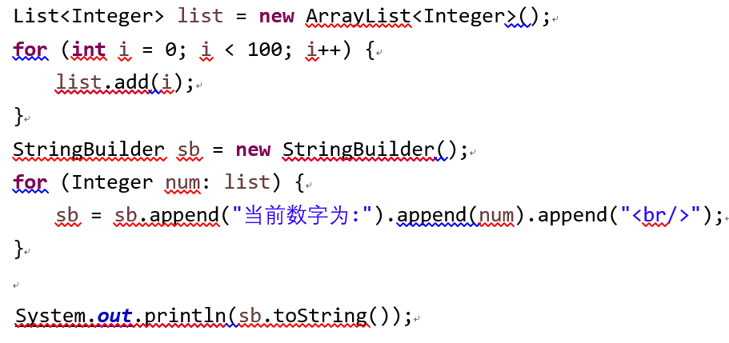

# 20届找实习之阿里，头条，网易，小米，搜狐，商汤，滴滴面经合集
原文参考： [20届找实习之阿里，头条，网易，小米，搜狐，商汤，滴滴面经合集][1]
# 总结：
个人感觉回答面试官问题不必太官方和书面化，腾讯sng招实习被发现照着百度百科念。结果可想而知。用自己的话和理解去回答就好。可能应届生会抱怨设计题，个人感觉尽量去做，把自己平时积累的知识点，思想和能力尽量去展示就好，可能面试官对你的回答期望不是太高。每面完，我就问面试官对我们在校学习有什么建议，无外乎，努力，多写代码多动手，保持持续学习的心态，关注一些新技术。加油你们都是最棒的！

# 头条一二面（挂）
## 头条1面：
- 自我介绍
- 项目介绍
- 平时使用开的环境
- redis获取一个hash的长度
- 用redis做过控频吗
- 能接受转语言吗
- http状态码301,302
- 手写快排
## 头条2面：
网络部分：

- DHCP如何实现分配ip的  

发现阶段（DHCP客户端在网络中广播发送DHCP DISCOVER请求报文，发现DHCP服务器，请求IP地址租约）、提供阶段（DHCP服务器通过DHCP OFFER报文向DHCP客户端提供IP地址预分配）、选择阶段（DHCP客户端通过DHCP REQUEST报文确认选择第一个DHCP服务器为它提供IP地址自动分配服务）和确认阶段（被选择的DHCP服务器通过DHCP ACK报文把在DHCP OFFER报文中准备的IP地址租约给对应DHCP客户端）。

- OSI七层模型，每层都说下自己的理解和知道的，说的越多越好
- TCP和UDP的区别，TCP如何保证可靠传输的
- 说一下常使用的协议及其对应的端口
## Linux部分：
- I/O多路复用
- 进程间如何通信
- 动态链接和静态链接的区别
- 进程的内存分布
- 如何查找一个进程打开所有的文件
- 设计模式：
- 工厂设计模式
- 单例设计模式
- 讲一下，说一下应用的场景。

# 网易两面（过,周一hr面）
## 一面
- 自我介绍
- hashmap
- 怎么优化这段代码 
	

### 两道简单算法  

1. 求连续子数组的最大和问题
2. 走格子，从一个出发点到终点，只能向上和向右有多少种走法，连障碍点都没有

- Java如何进行垃圾回收的
- 你用过哪些设计模式？回答：单例，观察者，工厂，责任链，适配器
- JDK中哪些实现了单例模式？java.lang.reflect.Proxy类，java.lang.Runtime类，线程池。
### 两道设计题
第一道设计题：
比如我有个电商平台，做每日订单的异常检测，服务端代码应该写。、   

第二道设计题：
比如窝网易邮箱春节要做一个活动，我网易邮箱用户量有3.4亿吧！但是我只允许8千万人参加，最后在8千万人里面产生一二三等奖，有一台物理机和一台数据库服务器。你怎么来设计。

## 二面
- 为什么会有内核态，保护模式你知道吗?
- 文件是怎么在磁盘上存储的？
- 有了进程为何还要线程呢，不同进程和线程他们之间有什么不同。
- 进程是资源管理的最小单位，线程是程序执行的最小单位。在操作系统设计上，从进程演化出线程，最主要的目的就是更好的支持SMP以及减小（进程/线程）上下文切换开销。
- dhcp数据包格式及其原理
- innodb聚集索引b+树叶子节点和磁盘什么顺序相同。

# 阿里面试
## 阿里一面(过)
1. 自我介绍
2. 全程怼项目，问的及其细，包括你为什么选择这种方案来实现，具体怎么存储怎么做的，相当细，遇到这类面试官，项目不够熟，就会翻车了。
3. redis原子操作怎么用比较好
4. 消息队列会吗？

## 阿里二面
### 操作系统模块：
1. 说一下并行和并发的区别
2. 你知道进程吗？有进程为何还有线程？
3. 操作系统是如何调度进程呢的
4. 比如linux下我打开一个文件调用read函数，整个过程说的越详细越好。
5. 同步异步阻塞非阻塞IO
6. 其他记不起来了。其实这些扩展开来就能说很多，就包含文件系统，进程管理和调度，就差内存管理机制了，我自己说了，虚地址保护模式。

### 网络模块：
- TCP报文格式
- TCP和UDP
- 拥塞控制
- 超时重传
- 三次握手
- 滑动窗口
- 常见协议的端口号

### 数据库模块：
- 索引数据结构
- 索引优化
- 存储引擎
- 事务（spring框架如何实现事务的呢）
- 分库分表

### Java模块：
- hashmap
- Arraylist和linkedlist
- voliate
- 线程池,如何根据CPU的核数来设计线程大小，如果是计算机密集型的呢，如果是IO密集型的呢？
- countdownlatch和CyclicBarrier底层实现原理
- 线程状态以及API怎么操作会发生这种转换

### JVM：
他说只问三个问题，
1. 垃圾什么时候被回收
2. 是怎么回收的呢
3. 忘了。。。。

### 分布式：
1. redis
2. 分布式事务解决
3. 消息队列
4. 分库分表
5. CAP
暂时只能记起这么多

明天醒了再补，时长1小时17分钟。你打住我知道你的掌握程度了期间这句话说了很遍。我知道了，你不用说的这么详细。我们不在这个上面纠缠了，下一个。
## 阿里三面：
- 自我介绍
- hashmap
- 红黑树
- 微信附近的人这个功能怎么实现的
- 项目问的很多
- 就聊了20分钟

# 小米面试
## 小米一面(过，下午二面)
- 自我介绍
- 项目介绍
- 类加载机制
- 垃圾回收算法
- G1垃圾回收器
- hashmap，hashtable,concurrenthashmap(JDK1.8)
- BIO和NIO
- 三次握手
- 流式计算
- 悲观锁，乐观锁
- spring bean生命周期
###  进程和线程
- linux下排查某个死循环的线程
- Arraylist和linkedlist
- 解决hash冲突的方法
- 跳跃表

## 小米二面：
- 自我介绍
- 项目
- 如果你的项目出现了内存泄露，怎么监控这个问题呢
- 一致性哈希算法
- 两个单链表相交，找到交点共享文档手写代码
- nio和bio，bio底层怎么实现的呢
- select poll epoll区别
- redis为何效率高
- 熟悉开源消息队列吗？讲一下
- ngix+redis集群+session共享或者同步
- 问下你有面试其他公司吗？都有哪些offer呢

上午被他们看完博客，说一面太简单了。
明明面了一个多小时，记不起来问题了（记起来了再补）
# 搜狐(offer)
- 项目问得很细。
- 自旋锁
- 标记清除和标记整理的区别和优缺点，为何标记整理会发生stoptheworld
- mysql索引，最左匹配原则，！=为何会索引失效
- 写sql举例最左匹配原则
- 解释下乐观锁和悲观锁
- 信纸上写反转单链表

你是找实习的，怎么不早说呢，你过了。
其他记不起了。
# 商汤
- 让你设计一个cache如何设计
- redis过期策略是怎么实现的呢
- mysql存储引擎，更适合做哪种应用，
- 哪些情况下索引会失效
- 建立索引需要注意哪些情况
- 垃圾回收
- CAS
- 新生代对象如何迁移到老年代对象
- G1
- ReentrantLock实现原理
- spring aop
- hashmap
- concurrenthashmap

面试官我要招一个尽快入职，主要你时间不匹配，说这句话我就知道gg了，不过我会把你简历留着，再招的话可以通知你。
# 滴滴（offer）
## 滴滴一面：
很奇怪，这面试官不说话。让你自己讲，中间偶尔问下问题，这是故作高深吗？把毕生功力都展示出来了。
比如我虚地址保护模式是80286开始支持的，描述子里面放读写权限，地址空间，段基址，加上偏移量完成从虚地址到物理地址的转换。

- CAP理论
- mysql能讲的都讲了
- Java差不多也是的，多线程，thread，runnable，从cyclebarrier，countdownLatch，线程池到- 自定义线程池（缓存，拒绝策略，核心数）。

最后说一到两周给通知。

[1]: http://junxuelian.cn/2018/03/08/20%E5%B1%8A%E6%89%BE%E5%AE%9E%E4%B9%A0%E4%B9%8B%E9%98%BF%E9%87%8C%EF%BC%8C%E5%A4%B4%E6%9D%A1%EF%BC%8C%E7%BD%91%E6%98%93%EF%BC%8C%E5%B0%8F%E7%B1%B3%EF%BC%8C%E6%90%9C%E7%8B%90%EF%BC%8C%E7%99%BE%E5%BA%A6%E7%AD%89%E9%9D%A2%E7%BB%8F%E5%90%88%E9%9B%86/